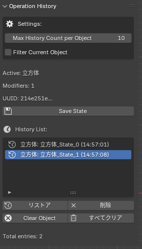

# Mamory_Select_log_on_blender

Blenderで選択中のオブジェクトの変更履歴を管理し、任意の時点に戻ることができるアドオンです。

## 使用技術

## 主な機能

### 機能一覧

- 選択中のオブジェクトの現在の状態を保存
- 任意の時点にオブジェクトの状態を復元
- 複数のオブジェクトの履歴を管理

#### 機能の詳細

  

## 機能説明

- **Setting**:
  - **Max History Count per Object:**  
  各オブジェクトの履歴の最大数を設定できます。
  - **Filter Current Object:**  
  現在選択中のオブジェクトのみを履歴に表示します。

- **Save State:**  
  現在選択中のオブジェクトの状態を保存します。
- **History List:**  
  保存されたオブジェクトの状態を一覧表示します。
- **Restore:**  
  選択した履歴のポイントにオブジェクトの状態を変更します。
- **Delete:**  
  選択した履歴のポイントを削除します。
- **Clear Object:**  
  選択中のオブジェクトの履歴を全て削除します。
- **Clear All:**  
  全てのオブジェクトの履歴を削除します。

> ⚠️ **注意:** 削除された履歴は復元できません。

  

  

  

## インストール方法

1．**ダウンロード**
  - こちらのGithubからアドオンのZIPファイルをダウンロードします。
2. **Blenderへのインストール**
  - Blenderを起動し、`Edit` > `Preferences` > `Add-ons` > `Install...`を選択します。
  - ダウンロードしたZIPファイルを選択し、インストールします。
3. **アドオンの有効化**
    - インストール後、アドオンのリストから「Object History Manager」を検索し、有効化します。